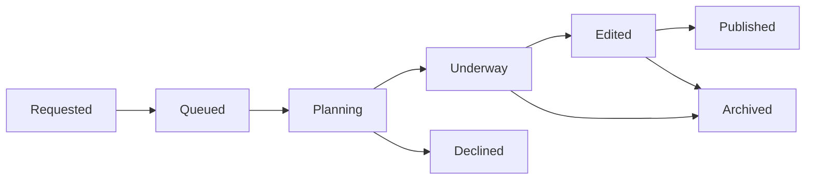

# 🛩️ Throttle Board - Flight Request Management System

<div align="center">


**A full-stack web application for managing flight simulation content requests**

[📱 Website](https://throttleandflaps.com)

</div>

---

## 🚀 Project Overview

**Throttle Board** is a comprehensive flight request management system built for **@ThrottleAndFlaps**, my Microsoft Flight Simulator content creator account. The platform enables community members to submit flight requests that are tracked through a complete workflow from submission to content publication.

### 🎯 Key Features

- **📝 Flight Request Submission**: Users can submit detailed flight requests with route preferences, aircraft specifications, and special notes
- **📊 Admin Dashboard**: Comprehensive management interface with Kanban-style workflow tracking
- **🔄 Real-time Status Updates**: Track requests through 8 different status stages with audit trails
- **🔍 Advanced Search & Filtering**: Powerful search capabilities across airports, routes, aircraft, and more
- **📱 Responsive Design**: Mobile-first approach with seamless desktop experience
- **🔐 Secure Authentication**: Role-based access control with admin privileges
- **📈 Analytics Dashboard**: Real-time statistics and completion metrics

---

## 🛠️ Technology Stack

### Frontend
- **React 18** with TypeScript for type-safe development
- **Vite** for lightning-fast development and optimized builds
- **Tailwind CSS** + **shadcn/ui** for modern, accessible UI components
- **React Router DOM** for client-side routing
- **React Hook Form** with Zod validation for robust form handling
- **TanStack Query** for efficient server state management

### Backend & Database
- **Supabase** (PostgreSQL) for database and authentication
- **Row Level Security (RLS)** for data protection
- **Real-time subscriptions** for live updates
- **RESTful API** design with TypeScript integration

### Development & Deployment
- **TypeScript** for type safety and better developer experience
- **ESLint** for code quality and consistency
- **Vite** for modern build tooling
- **Git** for version control

---

## 🏗️ Architecture & Design Patterns

### Database Schema
```sql
flight_requests (main entity)
├── id, status, requester_handle
├── route: origin_icao, destination_icao, cities
├── preferences: airline, aircraft, sim
├── metadata: priority, visibility, timestamps
└── notes: public, private

media_links (published content)
├── platform: youtube, tiktok, instagram
├── url, title, thumbnail_url
└── published_at

status_events (audit trail)
├── from_status, to_status
├── changed_at, comment
└── changed_by

profiles (user management)
├── user_id, display_name
├── avatar_url, bio
└── is_admin flag
```

### Application Architecture
- **Component-based architecture** with reusable UI components
- **Custom hooks** for business logic separation
- **Service layer** for API abstraction
- **Context providers** for global state management
- **Protected routes** with authentication guards

---

## 🚦 Status Workflow



**Status Stages:**
1. **Requested** - Initial submission
2. **Queued** - Added to production queue
3. **Planning** - Route and aircraft selection
4. **Underway** - Flight in progress
5. **Edited** - Post-production editing
6. **Published** - Content live on platforms
7. **Declined** - Request not feasible
8. **Archived** - Completed or cancelled

---

## 📱 Key Pages & Features

### Public Pages
- **🏠 Home Feed**: Browse all flight requests with filtering
- **📝 Submit Request**: Detailed form for flight submissions
- **📄 Request Details**: Individual flight information and timeline
- **ℹ️ About**: Platform information and guidelines

### Admin Dashboard
- **📊 Statistics Overview**: Real-time metrics and completion rates
- **📋 Kanban Board**: Visual workflow management
- **✏️ Flight Management**: Edit, update status, add media links
- **🔍 Advanced Filtering**: Search and filter by multiple criteria

---

## 🚀 Getting Started

### Prerequisites
- Node.js 18+ and npm
- Supabase account for backend services

### Installation

```bash
# Clone the repository
git clone https://github.com/yourusername/throttle-board.git
cd throttle-board

# Install dependencies
npm install

# Set up environment variables
cp .env.example .env.local
# Add your Supabase credentials

# Start development server
npm run dev
```

### Environment Variables
```env
VITE_SUPABASE_URL=your_supabase_url
VITE_SUPABASE_ANON_KEY=your_supabase_anon_key
```

### Available Scripts
```bash
npm run dev          # Start development server
npm run build        # Build for production
npm run preview      # Preview production build
npm run lint         # Run ESLint
```

---

## 🔧 Development Features

### Code Quality
- **TypeScript** for type safety
- **ESLint** configuration for consistent code style
- **Prettier** for code formatting
- **Component documentation** with JSDoc

### Performance Optimizations
- **React Query** for efficient data fetching and caching
- **Code splitting** with dynamic imports
- **Optimized bundle** with Vite
- **Lazy loading** for better initial load times

### Security Features
- **Row Level Security** in Supabase
- **Authentication guards** for protected routes
- **Input validation** with Zod schemas
- **XSS protection** with proper sanitization

---

## 📊 Project Metrics

- **📁 50+ Components** with reusable UI patterns
- **🔧 8 Custom Hooks** for business logic
- **📝 5 Main Pages** with full functionality
- **🗄️ 4 Database Tables** with relationships
- **🔐 15+ RLS Policies** for security
- **📱 100% Responsive** design

---

## 🌟 Highlights for Recruiters

### Technical Excellence
- **Modern React Patterns**: Hooks, Context, Suspense
- **TypeScript Mastery**: Full type coverage and interfaces
- **Database Design**: Normalized schema with proper relationships
- **Security Implementation**: RLS policies and authentication
- **Performance Optimization**: Query caching and code splitting

### User Experience
- **Intuitive Interface**: Clean, modern design with shadcn/ui
- **Mobile-First**: Responsive design for all devices
- **Real-time Updates**: Live status changes and notifications
- **Accessibility**: WCAG compliant components

### Business Logic
- **Complex Workflow Management**: Multi-stage approval process
- **Role-based Access Control**: Admin vs user permissions
- **Audit Trail**: Complete history of status changes
- **Analytics Integration**: Real-time metrics and reporting

---

## 🔗 Links & Resources

- **🌐 Live Application**: [throttleandflaps.com](https://throttleandflaps.com)
- **📱 Creator Website**: [throttleandflaps.com](https://throttleandflaps.com)
- **🐦 Social Media**: [@ThrottleAndFlaps](https://twitter.com/throttleandflaps)
- **📧 Contact**: Available upon request

---

## 📄 License

This project is proprietary software developed for @ThrottleAndFlaps. All rights reserved.

---

<div align="center">

**Built with ❤️ for the flight simulation community**

*Showcasing modern web development practices and full-stack expertise*

</div>
